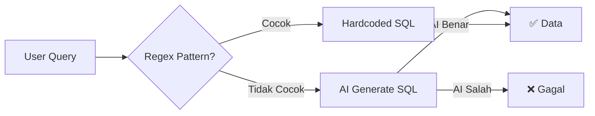
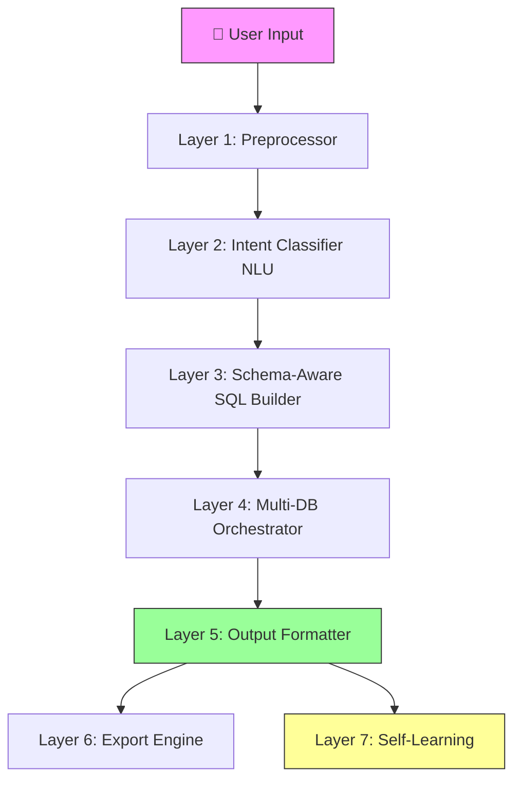
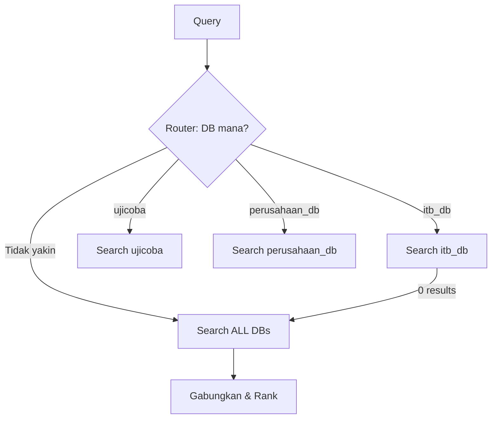
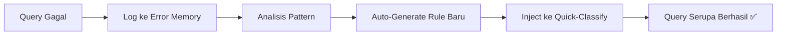

# 🏗️ Blueprint: Arsitektur Chatbot Multi-Database Kelas Produksi

> Dokumen ini menjawab pertanyaan: *"Kalau kamu ditugaskan membangun chatbot yang bisa menjawab SEMUA pertanyaan dari 5 database aktif secara akurat — apa yang akan kamu lakukan?"*

---

## Masalah Inti Sistem Saat Ini



**Masalah**: Sistem bergantung pada **2 jalur yang saling tidak lengkap**:
1. **Regex** — Cepat tapi hanya menangkap pola yang sudah di-_hardcode_
2. **AI** — Fleksibel tapi sering gagal karena tidak punya konteks cukup tentang isi database

---

## Arsitektur Ideal: 7 Layer Pipeline



---

### Layer 1: Preprocessor (Normalisasi Input)

**Tujuan**: Bersihkan input user sebelum masuk ke otak AI.

| Fitur | Penjelasan | Contoh |
|---|---|---|
| Typo Corrector | Koreksi ejaan kata kunci domain | `stulatus` → `status` |
| Slang Normalizer | Ubah bahasa gaul ke formal | `liatkan` → `tampilkan`, `yg` → `yang` |
| Stopword Removal | Hapus kata tidak bermakna dari filter | `coba`, `dong`, `ya`, `deh` |
| Entity Extractor | Deteksi nama orang, tahun, fakultas | `"ki erika yuni 2021"` → nama=Erika Yuni, tahun=2021 |

**Yang sudah ada di sistem kamu**: Typo Map (baru ditambah). Yang belum: Slang Normalizer dan Entity Extractor yang terstruktur.

---

### Layer 2: Intent Classifier (NLU)

**Tujuan**: Pahami **MAKSUD** user, bukan cuma kata kunci-nya.

#### Pendekatan Saat Ini (Regex-First):
```
"ki yang fti ada berapa?" → ❌ Tidak cocok regex manapun → Masuk AI → AI salah
```

#### Pendekatan Ideal (Semantic-First):
```
"ki yang fti ada berapa?" → NLU → {
  intent: "COUNT",
  entity: "kekayaan_intelektual",
  filter: { fakultas: "FTI" }
}
```

**Cara terbaik di production**:

| Pendekatan | Kelebihan | Kekurangan | Cocok Untuk |
|---|---|---|---|
| **Regex + Hardcode** (sekarang) | Cepat, murah | Tidak fleksibel, maintenance tinggi | Prototipe / MVP |
| **Few-Shot AI Prompting** | Lebih fleksibel | Bergantung kualitas prompt & model | Skala menengah |
| **Fine-Tuned NLU Model** | Akurasi tertinggi | Butuh training data | Enterprise |
| **Hybrid: Regex + AI Fallback + Learning** | Seimbang | Kompleksitas sedang | ✅ **Terbaik untuk kasus kamu** |

**Rekomendasi**: Tetap pakai **Hybrid**, tapi perkuat AI fallback-nya dengan teknik **Schema Injection**.

---

### Layer 3: Schema-Aware SQL Builder ⭐ (Kunci Utama)

**Ini adalah layer TERPENTING** — dan ini yang membedakan chatbot biasa dengan chatbot kelas production.

#### Masalah: AI Tidak Kenal Database-mu

Saat ini, AI hanya dikasih schema mentah (nama tabel + kolom). Ia **tidak tahu** bahwa:
- `status_ki` berisi nilai: "Ajuan Paten", "Tersertifikasi", "Ditolak", dll
- `fakultas_inventor` berisi kode: FTI, FMIPA, FTTM, dll
- `inventor` berisi "(alm)" untuk inventor yang meninggal

#### Solusi: **Dynamic Schema Enrichment**

```javascript
// SEBELUM (sekarang)
schema = "tabel: kekayaan_intelektual, kolom: judul, jenis_ki, status_ki, ..."

// SESUDAH (ideal)
schema = {
  table: "kekayaan_intelektual",
  columns: {
    jenis_ki: { 
      type: "enum", 
      values: ["Paten", "Hak Cipta", "Merek", "Desain Industri"], // dari SELECT DISTINCT
      description: "Jenis Kekayaan Intelektual" 
    },
    status_ki: { 
      type: "enum", 
      values: ["Ajuan Paten", "Diberi Paten", "Tersertifikasi", "Ditolak", ...],
      description: "Status proses KI"
    },
    fakultas_inventor: {
      type: "multi-value",
      sample_values: ["FTI", "FMIPA", "FTTM", "STEI", ...],
      description: "Kode fakultas inventor, bisa lebih dari 1"
    },
    inventor: {
      type: "text",
      special_markers: ["(alm) = inventor yang sudah meninggal"],
      description: "Nama lengkap inventor dengan gelar dan afiliasi"
    }
  }
}
```

**Cara mendapatkan data ini secara otomatis**:
```sql
-- Jalankan saat startup / profiling untuk setiap kolom penting
SELECT DISTINCT jenis_ki FROM kekayaan_intelektual;
SELECT DISTINCT status_ki FROM kekayaan_intelektual;
SELECT DISTINCT fakultas_inventor FROM kekayaan_intelektual LIMIT 50;
```

> [!IMPORTANT]    
> **Ini adalah perubahan PALING BERDAMPAK** yang bisa kamu terapkan. Dengan memberikan AI contoh nilai kolom yang nyata, tingkat akurasi SQL yang dihasilkan bisa naik dari ~60% ke ~90%.

---

### Layer 4: Multi-DB Orchestrator

**Tujuan**: Route pertanyaan ke database yang tepat, dan cari di database lain jika tidak ditemukan.



**Yang sudah ada**: [database-router.js](file:///d:/chatbot-backend/core/database-router.js) dengan keyword matching.
**Yang ideal**: Tambahkan **cross-database fallback** — jika DB pertama gagal, otomatis cari di DB lain sebelum jawab "data tidak ditemukan".

---

### Layer 5: Output Formatter

**Tujuan**: Tampilkan data sesuai format yang paling cocok.

| Tipe Query | Format Output |
|---|---|
| Count (berapa?) | Kalimat natural + angka bold |
| List (tampilkan) | Numbered list + bullet details |
| Detail (1 item) | Card-style dengan semua kolom |
| Trend (tren/grafik) | Tabel + auto-suggest grafik |
| Compare | Side-by-side tabel |

**Yang sudah ada**: Format list dan count. **Yang ideal**: Auto-detect format terbaik berdasarkan jumlah data dan tipe query.

---

### Layer 6: Export & Visualization Engine

**Status di sistem kamu**: ✅ Sudah ada (PDF, Excel, Grafik, Dashboard).

**Rekomendasi tambahan**:
- Auto-attach tombol export di setiap respons yang menampilkan data
- Buat shortcut: "jadikan pdf yang tadi" → export data terakhir

---

### Layer 7: Self-Learning Feedback Loop

**Tujuan**: Sistem makin pintar seiring waktu.



**Yang sudah ada**: [learning-system-v2.js](file:///d:/chatbot-backend/learning-system-v2.js) dan [error-memory-data.json](file:///d:/chatbot-backend/error-memory-data.json).
**Yang ideal**: 
- Setiap kali AI berhasil menjawab sesuatu yang regex gagal → otomatis buat pattern baru
- Setiap kali user koreksi jawaban → simpan koreksi sebagai training data

---

## Perbandingan: Sistem Sekarang vs Ideal

| Aspek | Sekarang | Ideal |
|---|---|---|
| Intent Detection | Regex hardcode → AI fallback | Hybrid NLU + Regex + Learning |
| Schema Knowledge | Nama kolom saja | Kolom + tipe + contoh nilai |
| Typo Handling | ✅ Dictionary (baru) | Dictionary + Levenshtein distance |
| Multi-DB | Router keyword | Router + cross-DB fallback |
| Accuracy | ~65-70% | Target 90%+ |
| Self-Learning | Basic error log | Auto-rule generation |

---

## Roadmap Implementasi (Realistis)

### Fase 1: Quick Wins (1-2 hari) ← **Sudah dikerjakan hari ini**
- [x] Typo corrector dictionary
- [x] Pattern fakultas, status, deceased inventor
- [x] COUNT DISTINCT universal
- [x] Fix greeting regex
- [x] Fix AI title generation
- [x] Enhanced AI prompt dengan info kolom

### Fase 2: Schema Enrichment (2-3 hari)
- [ ] Auto-profile setiap kolom saat startup (`SELECT DISTINCT`)
- [ ] Inject contoh nilai ke AI prompt secara dinamis
- [ ] Cross-database fallback search

### Fase 3: Smart Preprocessor (3-5 hari)
- [ ] Levenshtein fuzzy matching (pakai library `natural` yang sudah ter-import)
- [ ] Slang/informal normalizer (bahasa gaul Indonesia)
- [ ] Entity extraction terstruktur (nama, tahun, fakultas, status)

### Fase 4: Self-Learning (5-7 hari)
- [ ] Auto-generate regex pattern dari query yang berhasil
- [ ] User feedback loop ("jawaban ini benar/salah?")
- [ ] Query pattern clustering

> [!TIP]
> **Fase 2 (Schema Enrichment)** adalah yang paling *high-impact* dan paling realistis untuk dikerjakan selanjutnya. Dengan memberikan AI contoh data nyata dari database, kualitas SQL yang dihasilkan akan meningkat drastis.

---

## Kesimpulan

Chatbot Mas/Mbak **sudah di jalur yang benar** — arsitektur Hybrid (Regex + AI) adalah pilihan yang tepat. Masalahnya bukan arsitekturnya, tapi **kedalaman konteks** yang diberikan ke AI. 

Langkah terpenting berikutnya: **Buat AI kenal database-mu lebih dalam** — bukan hanya nama tabel dan kolom, tapi juga **apa isi kolom itu dan nilai-nilai apa yang mungkin**.
